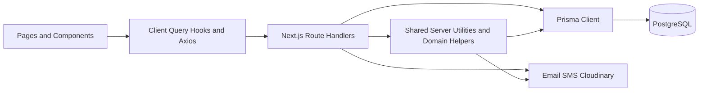

# Project Development Analysis

## 1. Purpose of This Document

This document is a project development analysis for the University Dissemination App repository.

It is written to help you:

- understand how the system is currently structured
- see how the main application layers interact
- identify the design patterns already in use
- review how Prisma and PostgreSQL are being used
- understand where the codebase is strong and where it is becoming hard to maintain
- see a practical roadmap for improving long-term architecture quality

This analysis is based on the current repository implementation, not on an idealized architecture.

---

## 2. Executive Summary

This project is a **production-grade modular monolith** built with **Next.js App Router**, **Prisma ORM**, and **PostgreSQL**.

At a high level:

- the **frontend is feature-oriented and role-oriented**, with separate route areas for administrator, department admin, lecturer, student, enrollment, and auth
- the **client-side data layer is reasonably clean**, using React Query and a shared Axios client
- the **backend is implemented through Next.js route handlers**, with direct Prisma access and shared infrastructure utilities in `src/lib`
- the **database model is mostly normalized**, especially around academic structure, offerings, enrollments, applications, and messaging
- the **main architectural weakness is backend duplication and route-level business logic concentration**

The repository is already strong enough for real production usage, but it is not yet at a mature enterprise architecture standard because:

- too much business logic lives inside route handlers
- several role-based modules are duplicated instead of shared
- some schema fields reduce long-term integrity and queryability
- there is no visible automated test suite or CI workflow in the repository
- operational concerns like rate limiting, background jobs, and centralized audit usage are incomplete

In short:

> The project is a strong modular monolith with solid product engineering foundations, but it now needs architectural consolidation more than new feature scaffolding.

---

## 3. Technology Profile

| Area                 | Current Choice               | Notes                                                                                           |
| -------------------- | ---------------------------- | ----------------------------------------------------------------------------------------------- |
| Frontend Framework   | Next.js 16 App Router        | Route-driven application structure                                                              |
| UI Runtime           | React 19                     | Modern React with client/server separation                                                      |
| Client Data Fetching | TanStack React Query         | Strong caching and request coordination                                                         |
| Client HTTP Layer    | Axios                        | Shared instance in [src/lib/axios.ts](src/lib/axios.ts)                                         |
| State Management     | Zustand                      | Used selectively for local app state and persistence                                            |
| Authentication       | Better Auth                  | Configured in [src/lib/auth.ts](src/lib/auth.ts)                                                |
| ORM                  | Prisma                       | Shared DB client in [src/lib/prisma.ts](src/lib/prisma.ts)                                      |
| Database             | PostgreSQL                   | Managed through Prisma schema and migrations                                                    |
| Validation           | Zod + ad hoc checks          | Inconsistent across endpoints                                                                   |
| Email                | Nodemailer + React Email     | Wrapped in [src/lib/email-service.ts](src/lib/email-service.ts)                                 |
| SMS                  | Custom UelloSend integration | Wrapped in [src/lib/sms-service.ts](src/lib/sms-service.ts)                                     |
| Media Uploads        | Cloudinary                   | Wrapped in [src/lib/cloudinary/cloudinary-service.ts](src/lib/cloudinary/cloudinary-service.ts) |

---

## 4. Architectural Style

### 4.1 Primary Architectural Style

The project is best described as a:

**Modular monolith with feature-based frontend organization and route-centric backend orchestration**.

It is **not classic MVC**.

It is also **not a microservice architecture**.

The system is deployed as one application, but it is partitioned internally into modules by:

- user role
- feature area
- shared infrastructure
- API boundary

### 4.2 Why This Classification Fits

The structure shows a consistent pattern:

- UI pages and layouts live in [src/app](src/app)
- reusable UI pieces live in [src/components](src/components)
- client-side request hooks and API wrappers live in [src/services](src/services)
- shared server and infrastructure utilities live in [src/lib](src/lib)
- persistent storage is modeled in [prisma/schema.prisma](prisma/schema.prisma)
- API endpoints live in [src/app/api](src/app/api)

This means the project is layered, but the layers are not equally mature.

The frontend layering is stronger than the backend layering.

### 4.3 High-Level Architecture Diagram



---

## 5. Repository Structure and Responsibility Separation

### 5.1 Root-Level Structure

The most important root-level directories and files are:

- [prisma](prisma) - database schema and migrations
- [src/app](src/app) - route tree, layouts, pages, and API endpoints
- [src/components](src/components) - reusable feature and UI components
- [src/services](src/services) - client-side data access hooks and API wrappers
- [src/lib](src/lib) - shared infrastructure and backend helper utilities
- [src/stores](src/stores) - Zustand local state stores
- [src/types/index.ts](src/types/index.ts) - shared request, response, and feature types

### 5.2 Folder-by-Folder Breakdown

| Folder                           | Responsibility                             | Key Observation                                                                   |
| -------------------------------- | ------------------------------------------ | --------------------------------------------------------------------------------- |
| [src/app](src/app)               | Pages, layouts, route groups, API routes   | Core application entry structure                                                  |
| [src/app/api](src/app/api)       | Backend endpoints                          | Most backend business logic currently lives here                                  |
| [src/components](src/components) | UI components grouped by feature and actor | One of the cleaner parts of the codebase                                          |
| [src/services](src/services)     | Client-side React Query services           | Despite the name, these are mostly frontend services, not backend domain services |
| [src/lib](src/lib)               | Shared runtime infrastructure              | Prisma, auth, email, SMS, notifications, upload helpers                           |
| [src/stores](src/stores)         | Local persisted client state               | Used selectively, especially for enrollment and auth UI state                     |
| [prisma](prisma)                 | Data model and migration history           | Mature enough for production use                                                  |

### 5.3 Important Structural Insight

The `src/services` folder is easy to misunderstand.

These files are mostly **client-side query/mutation wrappers** such as:

- [src/services/admin/announcements/announcements.ts](src/services/admin/announcements/announcements.ts)
- [src/services/enrollment/enrollment.ts](src/services/enrollment/enrollment.ts)
- [src/services/notifications/notifications.ts](src/services/notifications/notifications.ts)

They are **not the primary business logic layer on the server**.

That distinction matters because the codebase looks more layered than it really is. The backend domain logic still largely resides in route files.

---

## 6. How the Main Parts Interact

### 6.1 General Data Flow

The typical request path looks like this:

1. A page renders a feature client component.
2. The feature component calls a React Query hook from `src/services`.
3. The hook uses the shared Axios client in [src/lib/axios.ts](src/lib/axios.ts).
4. The request hits a Next.js route handler under [src/app/api](src/app/api).
5. The route handler authorizes the request using helpers from [src/lib/server.ts](src/lib/server.ts).
6. The route handler queries or mutates data using [src/lib/prisma.ts](src/lib/prisma.ts).
7. The route handler may call infrastructure helpers such as notification, email, SMS, or upload modules.
8. Prisma persists changes into PostgreSQL.

### 6.2 Example Flow: Admin Announcement Management

This is one of the clearest end-to-end flows in the repository.

#### Frontend side

- Page shell: [src/app/administrator/announcements/page.tsx](src/app/administrator/announcements/page.tsx)
- Main client component: [src/components/admin/announcements/AnnouncementsClient.tsx](src/components/admin/announcements/AnnouncementsClient.tsx)
- Query/mutation client service: [src/services/admin/announcements/announcements.ts](src/services/admin/announcements/announcements.ts)

#### Backend side

- Route list/create handler: [src/app/api/administrator/announcements/route.ts](src/app/api/administrator/announcements/route.ts)
- Route detail/update/delete handler: [src/app/api/administrator/announcements/[id]/route.ts](src/app/api/administrator/announcements/[id]/route.ts)
- Notification fan-out helper: [src/lib/announcement-notifications.ts](src/lib/announcement-notifications.ts)

#### Interaction summary

- UI triggers list or mutation hooks
- hooks call `/api/administrator/announcements`
- route validates auth using `requireAdmin`
- route performs Prisma reads or writes directly
- published announcements trigger best-effort email, SMS, and in-app notifications

This is a functional design, but the route handlers are acting as controller, service, validator, mapper, and orchestrator at the same time.

### 6.3 Example Flow: Enrollment Submission

#### Frontend side

- Enrollment landing page: [src/app/enrollment/page.tsx](src/app/enrollment/page.tsx)
- Enrollment state store: [src/stores/enrollmentStore.ts](src/stores/enrollmentStore.ts)
- Enrollment API hooks: [src/services/enrollment/enrollment.ts](src/services/enrollment/enrollment.ts)

#### Backend side

- Submission route: [src/app/api/enrollment/submit/route.ts](src/app/api/enrollment/submit/route.ts)

#### Interaction summary

That route currently does all of the following in one file:

- payload validation
- department/programme consistency checks
- academic session lookup
- account creation logic
- Better Auth-compatible password hashing
- student profile creation
- application creation
- fee materialization
- email and SMS notification orchestration

This is a strong example of a **transaction script style implementation**.

### 6.4 Example Flow: Messaging

#### Frontend side

- Lecturer messaging service: [src/services/messaging/lecturer/messaging.ts](src/services/messaging/lecturer/messaging.ts)
- Student messaging service: [src/services/messaging/student/messaging.ts](src/services/messaging/student/messaging.ts)

#### Backend side

- Lecturer message route: [src/app/api/messaging/lecturer/messages/route.ts](src/app/api/messaging/lecturer/messages/route.ts)
- Student message route: [src/app/api/messaging/student/messages/route.ts](src/app/api/messaging/student/messages/route.ts)
- Outbound external notification helper: [src/lib/message-notifications.ts](src/lib/message-notifications.ts)

#### Interaction summary

The messaging flow is permission-sensitive and course-context-aware:

- lecturer and student visibility are computed from assignments and enrollments
- messages are stored in the database
- in-app notification rows are created in bulk
- email and SMS notifications are sent as best-effort follow-up actions

This is a reasonable approach for a modular monolith, but it would scale better if the external delivery stage moved to a queue or job worker.

---

## 7. Design Patterns Found in the Codebase

### 7.1 Required Pattern Review

| Pattern   | Where It Appears                                                                                                                                                                                                                                                                                                                                            | Why It Is Used                                                                      | Assessment                  |
| --------- | ----------------------------------------------------------------------------------------------------------------------------------------------------------------------------------------------------------------------------------------------------------------------------------------------------------------------------------------------------------- | ----------------------------------------------------------------------------------- | --------------------------- |
| Singleton | [src/lib/prisma.ts](src/lib/prisma.ts), [src/lib/auth.ts](src/lib/auth.ts), [src/lib/email-service.ts](src/lib/email-service.ts), [src/lib/sms-service.ts](src/lib/sms-service.ts), [src/components/providers/providers.tsx](src/components/providers/providers.tsx)                                                                                        | Shared runtime objects should be reused across requests or across the app lifecycle | Correct and intentional     |
| Factory   | `createPrismaClient` in [src/lib/prisma.ts](src/lib/prisma.ts), `buildTransportConfig` in [src/lib/email-service.ts](src/lib/email-service.ts)                                                                                                                                                                                                              | Create environment-dependent infrastructure instances                               | Correct and intentional     |
| Builder   | Metadata construction in [src/lib/announcement-notifications.ts](src/lib/announcement-notifications.ts) and email payload assembly in [src/lib/email-service.ts](src/lib/email-service.ts)                                                                                                                                                                  | Incrementally assemble structured payloads                                          | Partial and informal        |
| Facade    | [src/lib/notification-service.ts](src/lib/notification-service.ts), [src/lib/email-service.ts](src/lib/email-service.ts), [src/lib/sms-service.ts](src/lib/sms-service.ts), [src/lib/cloudinary/cloudinary-service.ts](src/lib/cloudinary/cloudinary-service.ts)                                                                                            | Hide complexity of infrastructure integrations behind simpler app-specific APIs     | Correct and useful          |
| Adapter   | [src/lib/prisma.ts](src/lib/prisma.ts), [src/lib/auth.ts](src/lib/auth.ts), [src/lib/api-client-error.ts](src/lib/api-client-error.ts), [src/lib/cloudinary/cloudinary-service.ts](src/lib/cloudinary/cloudinary-service.ts)                                                                                                                                | Convert one library interface into the shape needed by the app                      | Correct and intentional     |
| Strategy  | Role-based branching in [src/hooks/useRouteToDashboard.tsx](src/hooks/useRouteToDashboard.tsx), role-aware URL generation in [src/lib/announcement-notifications.ts](src/lib/announcement-notifications.ts)                                                                                                                                                 | Select behavior depending on role or mode                                           | Partial and implicit        |
| Observer  | Direct post-event notifications from [src/app/api/administrator/announcements/route.ts](src/app/api/administrator/announcements/route.ts), [src/app/api/department-admin/announcements/route.ts](src/app/api/department-admin/announcements/route.ts), [src/app/api/messaging/lecturer/messages/route.ts](src/app/api/messaging/lecturer/messages/route.ts) | React to publication or messaging events with downstream notifications              | Partial and tightly coupled |

### 7.2 Detailed Notes by Pattern

#### Singleton

This pattern is one of the most clearly implemented in the repository.

- Prisma uses a global singleton in [src/lib/prisma.ts](src/lib/prisma.ts) to avoid exhausting connections during local development.
- Better Auth configuration is centralized in [src/lib/auth.ts](src/lib/auth.ts).
- Email and SMS service classes are instantiated once and exported.

This is appropriate and correctly implemented.

#### Factory

The project uses lightweight factories rather than formal abstract factories.

- [src/lib/prisma.ts](src/lib/prisma.ts) creates either a direct PostgreSQL adapter-backed Prisma client or an Accelerate-backed client depending on environment
- [src/lib/email-service.ts](src/lib/email-service.ts) builds mail transport config dynamically from environment variables

This is a good use of simple factory logic.

#### Builder

There is no formal builder class, but there are repeated builder-like operations where structured metadata is assembled piece by piece before being stored or delivered.

This is not wrong, but it is not a full builder pattern in the classical sense.

#### Facade

Facade usage is one of the stronger architectural traits in this repository.

Examples:

- [src/lib/notification-service.ts](src/lib/notification-service.ts) hides notification persistence details
- [src/lib/email-service.ts](src/lib/email-service.ts) hides template rendering and mail sending details
- [src/lib/sms-service.ts](src/lib/sms-service.ts) hides the external SMS provider details
- [src/lib/cloudinary/cloudinary-service.ts](src/lib/cloudinary/cloudinary-service.ts) hides Cloudinary upload details

These modules reduce repeated integration code across features.

#### Adapter

Adapter usage is also strong.

- Better Auth is adapted to Prisma in [src/lib/auth.ts](src/lib/auth.ts)
- Axios errors are adapted into domain-specific client errors in [src/lib/api-client-error.ts](src/lib/api-client-error.ts)
- Cloudinary responses are normalized into an application-specific shape in [src/lib/cloudinary/cloudinary-service.ts](src/lib/cloudinary/cloudinary-service.ts)

This is correctly done.

#### Strategy

Strategy is present mostly as branching logic rather than as interchangeable strategy objects.

Examples:

- role-based dashboard routing in [src/hooks/useRouteToDashboard.tsx](src/hooks/useRouteToDashboard.tsx)
- role-based announcement URLs in [src/lib/announcement-notifications.ts](src/lib/announcement-notifications.ts)
- mode-based announcement behavior in [src/app/api/administrator/announcements/route.ts](src/app/api/administrator/announcements/route.ts)

This is acceptable, but if the decision logic grows further, formalizing strategies would improve maintainability.

#### Observer

The codebase uses observer-like behavior, but not through a proper event bus.

For example:

- publishing an announcement triggers downstream notification work
- sending a message triggers in-app and external notification work

However, the publisher directly calls the notification helper. That means this is more like synchronous event chaining than a true decoupled observer system.

### 7.3 Additional Patterns Present

#### Service Layer

There is a **client-side service layer** in [src/services](src/services), but the **server-side service layer is incomplete**.

#### Module Pattern

The repository uses file-scoped modules consistently, especially in `src/lib` and `src/services`.

#### DTO / Mapper Pattern

Shared request and response contracts live in [src/types/index.ts](src/types/index.ts), and routes usually map Prisma rows into API-specific DTOs.

This is a good practice and helps API consistency.

#### Transaction Script

This is the dominant backend pattern.

Examples include:

- [src/app/api/enrollment/submit/route.ts](src/app/api/enrollment/submit/route.ts)
- [src/app/api/lecturer/schedule/route.ts](src/app/api/lecturer/schedule/route.ts)
- [src/app/api/administrator/finance/programme-fees/route.ts](src/app/api/administrator/finance/programme-fees/route.ts)

Transaction script is not inherently bad, but it becomes difficult to scale once the number of use cases increases.

#### Repository Pattern

This pattern is largely absent.

Routes and helper modules access Prisma directly. That keeps the code simple, but it also means repeated read/write logic is duplicated across endpoints.

#### Dependency Injection

Formal DI is not present.

That is fine for a modular monolith of this size, but testability would improve if infrastructure dependencies were injectable in higher-risk modules.

---

## 8. System Layer Analysis

### 8.1 Presentation Layer

This layer includes:

- pages and layouts in [src/app](src/app)
- feature components in [src/components](src/components)
- providers in [src/components/providers](src/components/providers)

Examples:

- [src/app/layout.tsx](src/app/layout.tsx)
- [src/components/providers/providers.tsx](src/components/providers/providers.tsx)
- [src/components/admin/announcements/AnnouncementsClient.tsx](src/components/admin/announcements/AnnouncementsClient.tsx)

**Evaluation:** well separated from persistence concerns. This is one of the cleaner layers in the system.

### 8.2 Client Data Access Layer

This layer includes React Query hooks and HTTP wrappers in [src/services](src/services).

Examples:

- [src/services/admin/announcements/announcements.ts](src/services/admin/announcements/announcements.ts)
- [src/services/enrollment/enrollment.ts](src/services/enrollment/enrollment.ts)
- [src/services/notifications/notifications.ts](src/services/notifications/notifications.ts)

**Evaluation:** consistent and useful, but the naming is misleading because these are not backend services.

### 8.3 API Layer

This layer is implemented under [src/app/api](src/app/api).

Its responsibilities include:

- request parsing
- authentication and authorization
- validation
- response shaping
- Prisma access
- orchestration of side effects

**Evaluation:** clear as an API boundary, but too many endpoints do much more than boundary work.

### 8.4 Business Logic Layer

Some business logic is extracted into shared helpers such as:

- [src/lib/student-auto-enrollment.ts](src/lib/student-auto-enrollment.ts)
- [src/lib/announcement-notifications.ts](src/lib/announcement-notifications.ts)
- [src/lib/message-notifications.ts](src/lib/message-notifications.ts)
- [src/lib/department-notifications.ts](src/lib/department-notifications.ts)

However, most domain rules still live inside route handlers.

**Evaluation:** partial. This is the main backend architecture gap.

### 8.5 Infrastructure Layer

Infrastructure concerns are centralized in `src/lib`, especially:

- auth
- Prisma
- email
- SMS
- Cloudinary
- generic server guards

Examples:

- [src/lib/auth.ts](src/lib/auth.ts)
- [src/lib/prisma.ts](src/lib/prisma.ts)
- [src/lib/server.ts](src/lib/server.ts)
- [src/lib/email-service.ts](src/lib/email-service.ts)

**Evaluation:** good. This layer is one of the most reusable and most transferable parts of the system.

### 8.6 Data Access Layer

Prisma is the active data access layer.

Most route handlers use Prisma directly through [src/lib/prisma.ts](src/lib/prisma.ts).

**Evaluation:** simple and effective, but repeated data access logic should be consolidated into shared application services or repository-like modules for the most complex use cases.

### 8.7 Database Layer

The database layer is PostgreSQL modeled through [prisma/schema.prisma](prisma/schema.prisma) and managed with migrations in [prisma/migrations](prisma/migrations).

**Evaluation:** structurally solid, but with several schema choices that will become liabilities over time if not corrected.

---

## 9. Prisma and Database Design Review

### 9.1 Strong Areas in the Schema

The schema has several good production traits:

- clear modeling of `Department`, `Programme`, `Course`, `CourseOffering`, `CourseAssignment`, and `Enrollment`
- composite uniqueness constraints that match domain rules
- explicit models for applications, application documents, and application status history
- notification, finance, and audit-related structures already exist
- migration history is organized and present in the repository

### 9.2 Normalization Review

The schema is **mostly normalized**, but there are notable exceptions.

#### Good normalization examples

- course assignments are modeled as a proper join table
- enrollments are modeled as a proper join table
- application documents are separate from applications
- programme fees are separate from fee obligations and payment transactions

#### Weak normalization examples

- [prisma/schema.prisma](prisma/schema.prisma) stores `enrolledCourses` in `StudentProfile` as `String[]`
- [prisma/schema.prisma](prisma/schema.prisma) stores `taughtCourses` in `LecturerProfile` as `String[]`
- [prisma/schema.prisma](prisma/schema.prisma) stores `headOfDept` in `Department` as a plain string

These fields duplicate or bypass relational truth.

**Recommendation:** replace these with relational references or derive them from existing tables.

### 9.3 Relation Quality

The academic relations are mostly well designed.

Examples of strong relationships:

- `Programme -> Department`
- `Course -> Department`
- `CourseOffering -> Course, Department, Session, Semester`
- `Enrollment -> CourseOffering, User`
- `Application -> Department, Programme, Session`

However, finance relations are weaker than the academic relations.

`Fee.studentId` and `PaymentTransaction.studentId` are stored as raw strings rather than strong user relations.

That makes integrity, cascade behavior, and future reporting more fragile than necessary.

### 9.4 Query Efficiency Review

There are several good practices already in use:

- `select` is used frequently to reduce payload size
- `Promise.all` is used for parallel independent reads
- `groupBy` and aggregate queries are used for analytics
- `createMany` and `updateMany` appear in some bulk operations

Examples:

- [src/app/api/announcements/route.ts](src/app/api/announcements/route.ts)
- [src/app/api/administrator/finance/analytics/route.ts](src/app/api/administrator/finance/analytics/route.ts)
- [src/app/api/notifications/route.ts](src/app/api/notifications/route.ts)

### 9.5 Performance Bottlenecks and Risk Areas

The biggest performance risks are not simple read queries. They are **write-heavy orchestration and synchronous side effects**.

#### Hotspots

- [src/lib/announcement-notifications.ts](src/lib/announcement-notifications.ts) performs recipient fan-out and external delivery in request-time flow
- [src/app/api/department-admin/staff-management/import/route.ts](src/app/api/department-admin/staff-management/import/route.ts) processes import rows sequentially with multiple queries per row
- [src/app/api/lecturer/schedule/route.ts](src/app/api/lecturer/schedule/route.ts) mixes authorization, scheduling logic, persistence, and notification work in one large handler

### 9.6 Potential N+1 Issues

There is not a strong presence of classic read-side N+1 Prisma misuse.

Most large reads are already batched with nested selects or grouped queries.

The more relevant issue is **fan-out write amplification**, especially in notifications and external message delivery.

### 9.7 Indexing Review

The schema has a good baseline of single-column indexes on:

- foreign keys
- status fields
- timestamps

That is a solid starting point.

However, the read paths in the app suggest several missing composite indexes.

#### Good candidates for composite indexes

- announcement feed filtering and ordering
- notifications by `userId`, `isRead`, `createdAt`
- fee reporting by `studentId`, `status`, `academicYear`
- payment history by `studentId`, `createdAt`
- message conversation lookups by sender/recipient pair and date

### 9.8 Money Type Review

Finance values are currently stored using `Float` in:

- programme fees
- fee obligations
- payment transactions

This is a long-term correctness risk.

**Recommendation:** move monetary values to Prisma `Decimal`.

### 9.9 Metadata and JSON Review

The schema stores structured data as strings in multiple places:

- notification metadata
- payment transaction metadata
- audit log details
- message attachments

This reduces queryability and increases parsing overhead.

**Recommendation:** use `Json` where the data is truly structured and intended to evolve.

### 9.10 Special Concern: Mutations Inside GET Endpoints

Two important endpoints perform writes during reads:

- [src/app/api/student/finance/route.ts](src/app/api/student/finance/route.ts)
- [src/app/api/administrator/finance/analytics/route.ts](src/app/api/administrator/finance/analytics/route.ts)

This creates problems for:

- cache correctness
- observability
- performance predictability
- semantic clarity

**Recommendation:** move fee status refresh and fee materialization to background jobs or explicit write flows.

---

## 10. Scalability and Maintainability Review

### 10.1 Strengths

#### 1. Clear modular monolith foundation

The repository is still understandable as one deployable application.

#### 2. Good UI and feature grouping

Feature and role grouping in `src/components` and `src/app` makes the frontend navigable.

#### 3. Shared infrastructure wrappers

Core integrations are already isolated behind reusable modules.

#### 4. Typed API contracts

Shared types in [src/types/index.ts](src/types/index.ts) reduce ambiguity between client and server.

#### 5. Consistent client request model

React Query usage in [src/services](src/services) is fairly consistent and easy to extend.

### 10.2 Weaknesses

#### 1. Route handlers are too large

Examples:

- [src/app/api/enrollment/submit/route.ts](src/app/api/enrollment/submit/route.ts)
- [src/app/api/lecturer/schedule/route.ts](src/app/api/lecturer/schedule/route.ts)
- [src/app/api/administrator/finance/programme-fees/route.ts](src/app/api/administrator/finance/programme-fees/route.ts)

These files are difficult to test, reuse, and safely evolve.

#### 2. Role-based duplication is growing

Admin and department-admin stacks repeat the same ideas and often nearly the same code.

Examples:

- announcement routes
- announcement client services
- staff provisioning logic

#### 3. Shared helper logic is duplicated

Functions like `toIso`, `toSafeInt`, `excerptFromContent`, Better Auth hashing, and credential account creation appear repeatedly across multiple route files.

#### 4. Some intended enterprise features are modeled but not implemented

Examples include:

- role-based access UI in [src/app/administrator/role-based-access/page.tsx](src/app/administrator/role-based-access/page.tsx)
- permission structures in schema and seed data
- audit log model without visible active use

#### 5. Type surface is too centralized

[src/types/index.ts](src/types/index.ts) is becoming a large catch-all contract file. Over time this becomes harder to navigate and own.

### 10.3 Testability Review

I did not find repository test files or CI workflows during the review.

That means the code quality depends mostly on manual validation and production confidence rather than automated guardrails.

This is the biggest non-code risk in the repository.

### 10.4 Reusability Review

Frontend reuse is decent.

Backend reuse is limited because too many domain rules are embedded directly in routes.

This means new features tend to copy patterns rather than reuse central application logic.

---

## 11. Security and Operational Review

### 11.1 Positive Security Traits

- Better Auth is integrated centrally in [src/lib/auth.ts](src/lib/auth.ts)
- route guards are centralized in [src/lib/server.ts](src/lib/server.ts)
- role-based access is enforced at least at the coarse role level for most protected routes

### 11.2 Security Gaps and Hardening Opportunities

#### Upload validation

[src/app/api/uploads/images/route.ts](src/app/api/uploads/images/route.ts) does not appear to enforce strict file type, file size, or content validation before buffering and uploading.

#### Rate limiting

No visible middleware or request-limiting layer was found in the repository.

This matters especially for:

- auth routes
- enrollment submission
- upload endpoints
- messaging routes

#### Audit log usage

The schema contains an audit log model, but no visible runtime usage was found.

#### Fine-grained RBAC

The repository contains permission models and seed data, but runtime access control is still mainly role-based, not permission-based.

### 11.3 Operational Maturity Gaps

The repository would benefit from:

- automated tests
- CI checks
- request logging and structured observability
- asynchronous worker processing for notification fan-out
- scheduled jobs for fee lifecycle maintenance

---

## 12. Key Architectural Strengths

The strongest architectural traits of this repository are:

### 12.1 Strong modular-monolith viability

The project is not over-engineered. It uses one deployable application and has enough internal structure to stay coherent.

### 12.2 Good infrastructure encapsulation

Prisma, auth, email, SMS, and Cloudinary are wrapped instead of scattered.

### 12.3 Good product-domain modeling

The academic domain has been modeled thoughtfully around sessions, semesters, offerings, enrolments, and applications.

### 12.4 Practical engineering choices

The codebase favors straightforward solutions over unnecessary abstraction. That is a net positive.

### 12.5 Consistent client-side architecture

React Query service hooks are consistently applied and easy to understand.

---

## 13. Key Architectural Weaknesses

The most important weaknesses to address are:

### 13.1 Backend logic concentration in routes

This is the single biggest maintainability issue.

### 13.2 Duplicated role modules

Admin and department-admin paths show clear duplication pressure.

### 13.3 Schema choices that reduce long-term integrity

Arrays for relational truth, string-based metadata, and float-based money values should be corrected.

### 13.4 Missing automated quality gates

The lack of visible tests and CI will eventually slow development and increase regression risk.

### 13.5 Synchronous external side effects

Email and SMS fan-out still happens too close to request time.

---

## 14. Recommended Improvement Roadmap

### Phase 1: High Impact, Low Structural Risk

These changes can be made without changing the product shape.

#### 1. Extract server-side application services

Create shared backend modules for use cases such as:

- announcements
- enrollment
- finance
- messaging
- staff provisioning

Then let route files focus on:

- auth
- request parsing
- response formatting

#### 2. Centralize account provisioning logic

Move password hashing and Better Auth credential account creation out of route files into one dedicated server module.

#### 3. Consolidate repeated helper functions

Extract shared utilities for:

- ISO date mapping
- pagination parsing
- markdown excerpt generation
- API error generation

#### 4. Add tests for high-risk flows

Start with:

- enrollment submission
- application approval
- announcement publication
- lecturer/student messaging authorization
- finance fee propagation

### Phase 2: Data and Operational Hardening

#### 5. Replace money `Float` with `Decimal`

This is important for financial correctness.

#### 6. Convert string metadata fields to `Json`

This will improve queryability and reduce parsing concerns.

#### 7. Add composite indexes based on real query patterns

Focus on announcements, notifications, finance, and messaging first.

#### 8. Remove state writes from `GET` routes

Move fee refresh logic into scheduled or explicit mutation-based processes.

### Phase 3: Enterprise-Grade Maturity Improvements

#### 9. Introduce event or job processing for notifications

This will decouple request latency from external delivery work.

#### 10. Activate audit logging for critical actions

Track events such as:

- application decisions
- staff provisioning
- role changes
- fee configuration updates
- announcement publishing

#### 11. Complete permission-based RBAC

The schema already supports it. The runtime layer and UI still need to catch up.

#### 12. Add CI pipeline and deployment validation

At minimum:

- lint
- typecheck
- test
- Prisma validation

---

## 15. Suggested Target Backend Structure

One practical next-step structure would look like this:

```text
src/
  app/
    api/
      ...route handlers only
  server/
    application/
      announcements/
      enrollment/
      finance/
      messaging/
      staff/
    domain/
      announcements/
      academic/
      finance/
      auth/
    infrastructure/
      prisma/
      auth/
      email/
      sms/
      uploads/
    shared/
      validation/
      mapping/
      errors/
```

This would let the project remain a modular monolith while clearly separating:

- request boundary logic
- application use-case orchestration
- infrastructure adapters
- reusable domain rules

---

## 16. Architecture Scorecard

| Category             | Score  | Explanation                                                                                       |
| -------------------- | ------ | ------------------------------------------------------------------------------------------------- |
| Architecture Quality | 7/10   | Strong modular monolith foundation, but backend layering is incomplete                            |
| Maintainability      | 5.5/10 | Feature growth is starting to create duplication and oversized route handlers                     |
| Scalability          | 6/10   | Good enough for growth, but synchronous side effects and duplicated logic will become bottlenecks |
| Code Organization    | 7/10   | Frontend structure is strong, backend structure is only partially consolidated                    |

### Overall Assessment

**Current overall maturity: solid production system, not yet full enterprise architecture.**

The repository is closer to:

- a well-built real-world product codebase

than to:

- a fully matured enterprise platform with complete application layering, eventing, audit coverage, CI discipline, and fine-grained security governance

That is not a criticism. It means the codebase has already crossed the hard part of becoming useful and production-capable. The next step is architectural refinement.

---

## 17. Final Conclusion

This project is already doing many things right:

- it has a coherent product domain
- it uses practical and modern technologies appropriately
- it has good frontend modularity
- it has workable infrastructure abstraction
- it has a strong enough schema foundation for continued growth

The main improvement theme is now **consolidation**.

The codebase should shift from:

- route-centered feature implementation

to:

- shared application services with thinner route boundaries

If that refactor is done carefully, this repository can become a very strong long-term platform without needing a full rewrite or a move to microservices.

---

## 18. Most Important Next Actions

If you want the highest-value architectural improvements with the least disruption, do these first:

1. Extract shared backend use-case modules from the largest route handlers.
2. Remove duplicated admin and department-admin business logic.
3. Add tests around enrollment, announcements, finance, and messaging permissions.
4. Replace finance `Float` fields with `Decimal` and string metadata with `Json`.
5. Move notification fan-out to an asynchronous background processing model.

These five changes would materially improve maintainability, scalability, and engineering confidence without changing the core product design.
